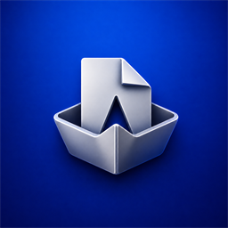
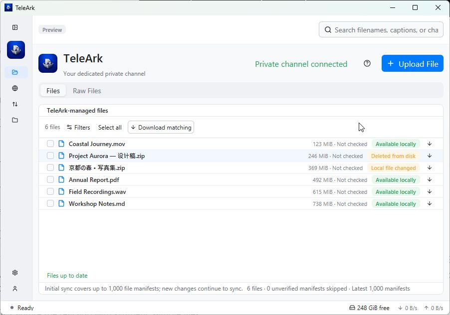

<div align="center">



# TeleArk

**Your files. Your Telegram. One workspace.**

A native desktop app for browsing Telegram files, managing transfers,<br>
and keeping encrypted files in your own private channel.

<p>
  <a href="https://apps.microsoft.com/detail/9NJD0FKQVR9B"></a>
  <a href="https://peppermintish.github.io/teleark/#downloads"></a>
  <a href="https://peppermintish.github.io/teleark/#macos-build"></a>
  <a href="https://peppermintish.github.io/teleark/#downloads"></a>
</p>

**[Explore the website](https://peppermintish.github.io/teleark/)** · **[Download TeleArk](https://peppermintish.github.io/teleark/#downloads)** · **[Releases](https://github.com/peppermintish/teleark/releases)**



<sub>Real desktop interface, with synthetic sample files.</sub>

</div>

## A calmer home for your files

| | What you can do |
| --- | --- |
| **Browse & find** | Search channel files and filter by type or date. Keep local downloads and remote files in separate library views. |
| **Store encrypted files** | Upload to a dedicated private Telegram channel. TeleArk encrypts locally and authenticates file manifests and restored contents. |
| **Download in batches** | Select individual files or download matching files together, including files in your TeleArk-managed channel. |
| **See work happening** | Follow synchronization phases, queues, retries, transfer charts and event timelines. Managed-channel sync runs alongside normal channels. |
| **Keep control** | Pause, resume, cancel or retry transfers where supported. Export your encryption key for recovery and import it on another device. |
| **Make it yours** | Light and dark themes, keyboard shortcuts, configurable storage paths, proxy settings and nine interface languages. |

## Get TeleArk

| Platform | Download | Details |
| --- | --- | --- |
| **Windows** | **[Get it from Microsoft Store](https://apps.microsoft.com/detail/9NJD0FKQVR9B)** | Windows 10 version 1809 or later / Windows 11, x64. |
| **Linux** | **[AppImage, Debian package & portable archive](https://peppermintish.github.io/teleark/#downloads)** | x64; packaged against an Ubuntu 22.04 baseline. |
| **macOS** | **[Universal downloads & local build guide](https://peppermintish.github.io/teleark/#macos-build)** | macOS 11+, Apple Silicon and Intel. Releases are not Apple-notarized. |

The [website](https://peppermintish.github.io/teleark/) provides direct Linux and macOS asset links, installation notes and a macOS source-build tutorial. Download links refresh when a GitHub release is published. Release assets include `SHA256SUMS` for integrity checks.

## Your channel, your encryption key

TeleArk connects to Telegram from your desktop and stores encrypted files in your own private channel. The **Files** tab presents each logical file once; **Raw Files** shows its underlying Telegram documents, encrypted parts and manifests.

File content is encrypted locally with AES-256-GCM and verified before a restored file is published to its destination. Telegram can still observe channel membership, object sizes and timing. The local catalog is not encrypted. Keep a safe copy of your exported key: access to the Telegram channel alone cannot decrypt your files. Read the [security model](docs/SECURITY.md) and [encrypted format](docs/CRYPTO_FORMAT.md) for the exact guarantees.

## Build from source

Install [Rust](https://rustup.rs/) and your platform's native build tools. On macOS, install Apple Command Line Tools with `xcode-select --install`; a paid Apple Developer account is not required for a local build. Linux dependencies and Windows build tools are listed in [Development](docs/DEVELOPMENT.md).

```sh
git clone https://github.com/peppermintish/teleark.git
cd teleark
cargo build --release -p teleark-gui --bin teleark --locked
```

Run `./target/release/teleark` on macOS/Linux, or `.\target\release\teleark.exe` on Windows. Source builds without distribution credentials ask for your own Telegram API ID and hash in the app; obtain them from [Telegram's application panel](https://my.telegram.org/apps).

For repeatable developer builds with private local configuration, follow [the local environment guide](docs/DEVELOPMENT.md#local-development-environment). Keep credentials in the Git-ignored `.env.local`; never commit them. Installer creation and release signing have separate requirements in [Packaging](docs/PACKAGING.md).

## Built in the open

TeleArk is written in **Rust**, with **GPUI Kit** for the native interface, **grammers / MTProto** for Telegram, and **SQLite / FTS5** for the local catalog. Core services are independent of the GUI; retained background workers handle network, filesystem, database and encryption work.

- [Architecture & decisions](docs/ARCHITECTURE.md) — service boundaries and ownership.
- [Development](docs/DEVELOPMENT.md) — setup, previews and quality checks.
- [Implementation status](docs/IMPLEMENTATION_STATUS.md) — delivered behavior and qualification limits.
- [Website maintenance](docs/WEBSITE.md) — preview, test and publish the GitHub Pages site.
- [Report a bug or request a feature](https://github.com/peppermintish/teleark/issues) — include reproducible steps; keep credentials and private files out of reports.

Licensed under **[MIT](LICENSE-MIT) OR [Apache-2.0](LICENSE-APACHE)**. Dependency acknowledgments are in [THIRD_PARTY_NOTICES.md](THIRD_PARTY_NOTICES.md).
